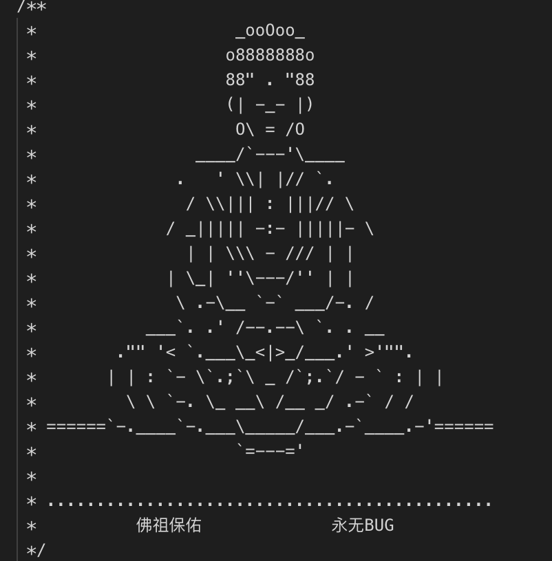

# video-to-char

起源是因为这张图片 

根据 canvas 的一个 api __getImageData__ 方法可以得到图像的信息, 其中可以获取 data 属性，data 属性保存着图片像素信息的一维数组，数组中每个值的范围是0~255，每四个值表示一个像素点的颜色信息。于是就可以做一些好玩的事

### 图片转字符画
### 视频转字符画
### 相似图片搜索

#TODO 解释原理