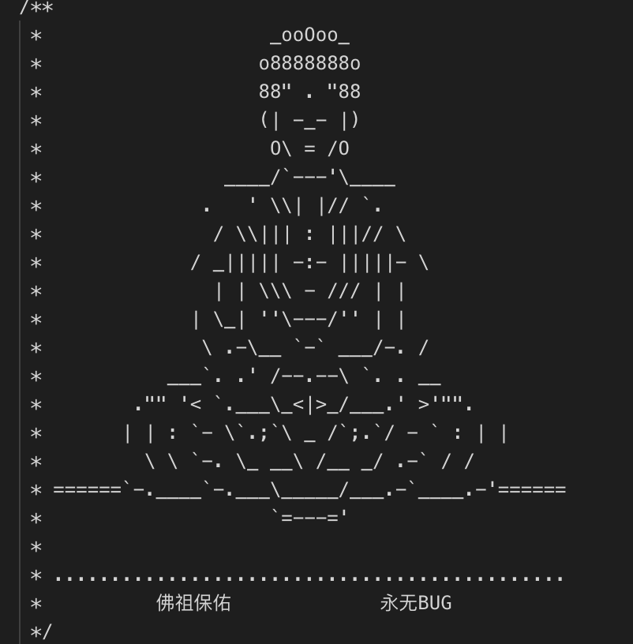
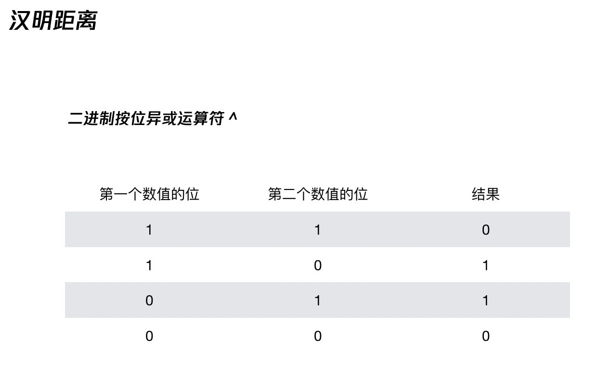
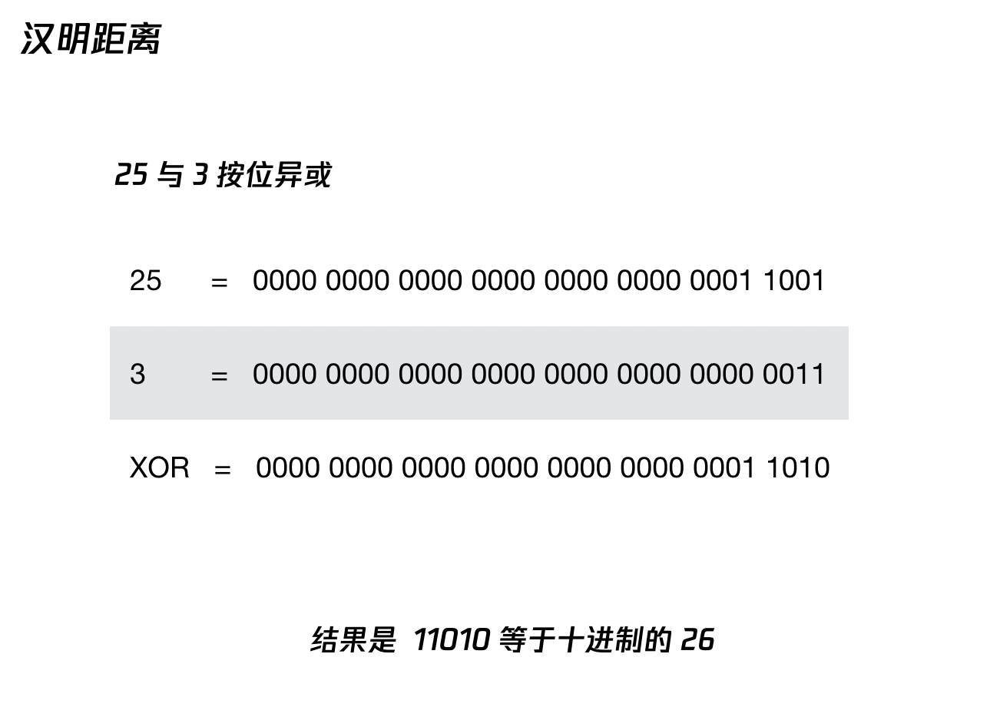
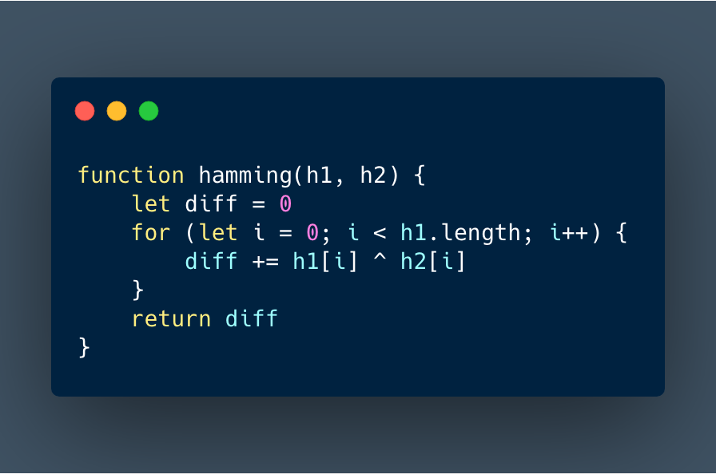

# video-to-char

起源是因为这张图片

实现原理是根据 canvas 的一个 api __getImageData__ 方法可以得到图像的信息, 其中可以获取 data 属性，data 属性保存着图片像素信息的一维数组，数组中每个值的范围是0~255，每四个值表示一个像素点的颜色信息。于是就可以做一些好玩的事

## 图片转字符画

[体验传送门](https://amfishers.github.io/video-to-char/img/index.html)(demo 可以使用 source 文件夹里面的 bad apple.mp4 文件，效果明细)

- 拿到 img 后通过 context.drawImage(img, 0, 0, canvas.width, canvas.height)    将 img 画到 canvas，再获取 ImageData.data 像素数据
- 计算出每个字符对应图片中的占有位置
- 根据图片的像素数据，计算图片平均灰度值，画布画上与灰度值相对应的字符
  - 灰度就是没有色彩，RGB色彩分量全部相等，彩色图象的灰度其实在转化为黑白图像后的像素值（是一种广义的提法），转化的方法看应用的领域而定，一般按加权的方法转换，R， G，B 的比一般为 3:6:1
  - 灰度计算   (R * 0.3 + G * 0.59 + B * 0.11)  
  - 灰度值对应字符：['@', 'w', '#', '$', 'k', 'd', 't', 'j', 'i', '.', ' ']

## 视频转字符画

 [体验传送门](https://amfishers.github.io/video-to-char/video/index.html)

- 建立 video 标签，将视频 drawImage 到 canvas 上（此时为视频当前的一帧）
- 调用之前绘制字符画的方法来绘制视频当前帧
- 设立个定时器,  按照 60FPS 的速率刷新这个方法，带到同步视频播放的效果

## 以图搜图

[体验传送门](https://amfishers.github.io/video-to-char/similarImg/index.html)

这里的关键技术叫做"感知哈希算法"（Perceptual hash algorithm），它的作用是对每张图片生成一个”指纹”（fingerprint）字符串，然后比较不同图片的指纹，结果越接近，就说明图片越相似。

#### 实现步骤

- 缩小尺寸
  - 将图片缩小到8x8的尺寸，总共64个像素。这一步的作用是去除图片的细节，只保留结构、明暗等基本信息，摒弃不同尺寸、比例带来的图片差异
  - 为什么要缩小呢： 如果一张 400 * 400 的图片，那么像素点总共就有 16w 个，如果就这么拿去比较计算，计算量相当惊人； 还有缩小尺寸可以 去除图片的细节，只保留结构、明暗等基本信息，摒（bing4）弃不同尺寸、比例带来的图片差异。 实现方法比较简单，但有个注意点就是把图片缩小后，drawImage 到 canvas 画布然后就可以拿到图片相应的 width height dataImage 了
- 简化色彩
  - 将缩小后的图片，转为64级灰度。也就是说，所有像素点总共只有64种颜色,计算所有64个像素的灰度平均值
  - 浮点算法：  (R * 0.3 + G * 0.59 + B * 0.11)  
- 比较像素的灰度
  - 将每个像素的灰度，与平均值进行比较；大于或等于平均值，记为1；小于平均值，记为0
- 计算哈希值
  - 将上一步的比较结果，组合在一起，就构成了一个64位的整数，这就是这张图片的指纹。得到指纹以后，就可以对比不同的图片，看看64位中有多少位是不一样的。在理论上，这等同于计算"汉明距离"（Hamming distance）。如果不相同的数据位不超过5，就说明两张图片很相似；如果大于10，就说明这是两张不同的图片。

#### 总结

优点：简单快速，不受图片大小缩放，简单特效处理的影响
缺点：图片的内容不能变更，如果在图片上加复杂文字，它就认不出来了

### 汉明距离
将一个字符串变换成另外一个字符串所需要替换的字符个数  —  汉明重量

举 🌰  
10086 与 10088 之间的汉明距离是 1
justdoit 与 justdohe 之间的汉明距离是 2

计算方法：

